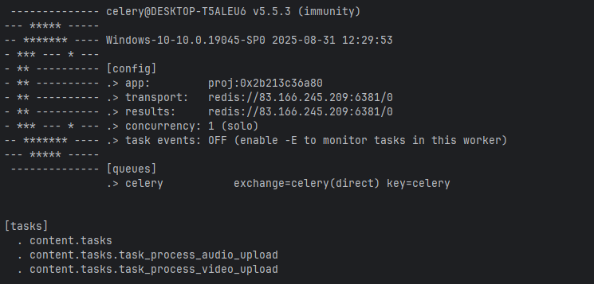

## Вопрос & Ответ
>> *пецифичные атрибуты: ссылка на видеофайл, ссылка на файл субтитров*
- локальная ссылка формируется при сохранении файла? *Пример: Когда user, через форму, выбирает файл из локального диска и сохраняет на сервере*. 
- внешная ссылка которую user добавляет к страницу?

### Note: 
Не зная ответ, на эти вопросы, создал три не обязательных поля  для видео файлов, и два не обязательных поля для аудио.

----
>> *Контент типа аудио (Audio)*\
>> *специфичные атрибуты: поле для хранения текста произвольной длинны*

Что подразумевалось под *хранения текста произвольной длинны*:
 - дополнительное текстовое описание к файлу, само аудио в виде файла на диске хранится?
 - пользователь выбирает файл на локальном диске (у себя), отправляет на сервер. Сам файл отправлятся в виде binary кода. Вот этот код и сохраняем на сервере в виде строки?
 - внешняя текстовая ссылка к месту нахождения файла?


----
>> При обращении к API с деталями о странице счетчик просмотров каждого объекта контента,привязанного к странице, должен увеличится на единицу.\
>> ...\
>> Сделать API для получения списка всех страниц ... \
> В ответе должен содержаться URL на API с детальной информацией о странице
(пункт №2)

Счётчик на каком событии должен срабатывать?

К API обращаемся когда хотим получить данные:
- одной страницы и получаем полные данные о странице. Тут контент НЕ просмотремнным быть  не может.
- спсика страниц и получаем полные данные по каждой странице (согласно ТЗ). Тут контент МОЖЕТ быть НЕ просмотренным, \
но согласно ТЗ счётчик должен увеличиваться.
    1) Контролировать просмотры той или иной страницы уже нет возможности т.Как данные полностью выгружены на сторону клиента/браузера.
    2) Поэтому требуется отдельный API для счетчиков и отдельный запрос от клиента при обращении на страницу ИЛИ для API списка всех страниц увеличиваем все счётчики (но, без гарантии, что страница будет просмотрена)
    3) Получается тут не идет речь об увеличении числа просмотров - видео контента. Счётчик срабатывает при использовании API.  
  
>> При обращении к API с деталями о странице

Согласно пп. №: 1, 2, 3, обращаясь к любому из API (п.1 и п.2) мы затрагиваем п.3.  

### Note:
Желание клиента закон. События из пунктов №: 1,2 увеличивают размер счетчиков для контента c nbgjv video & audio (без гарантии просмотра).

## CACHING
```python
import json
import asyncio 
def set_cache(caching_key: str, response) -> None:
    """
    This is sync function.
    Data is cache to the JSON's format.
    :param str caching_key: Template is '<page_data_<pk_from_url>_< pathname_from_apiurl >>'
    Exemple of 'caching_key' is the: 'page_data_2_/api/page/content/2/'.
    :param response:
    :return:
    """

    loop = asyncio.new_event_loop()
    asyncio.set_event_loop(loop)
    loop.run_until_complete(
        asyncio.to_thread(
            cache.set,
            timeout=(60 * 60 * 24),
            key=caching_key,
            value=json.dumps({"data": response.data}),
        )
    )
```

## Celery
