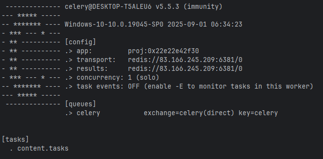

## APP использует


|                      |                               |                           |
|:---------------------|:------------------------------|:--------------------------|
| async "`Django`"     | async "`DRF`"                 | |
| "`Celery`"           | "`Radis`"                     | "`PostgreSQL` or "`ASQLite`" |
| "`daphne`"           | "`Signal`"                    | "`pytest`"                |
| [swagger](./swagger) | [nginx](./nginx/default.conf) |[docker-compose](./docker-compose.yml)   |
| "`asincio`"              | "`threading`"                     |"`GitHub Action`" |

---
### Tree
```text
mateImageAI/
├── backend/
│   ├── .github
│   |   └──workflows/*
│   ├── .gitignore
│   ├── manage.py
│   ├── requirements.txt
│   ├── __tsts__/
│   |   └──tests_content/*
│   ├── collectstatic/
│   |   └──drf-yasg/*
│   |   └──admin/*
│   |   └──rest_framework/*
│   |   └──scripts/*
│   |   └──styles/*
│   ├── img/
│   ├── content/
│   |   └──content_api/*.py
│   |   └──migrations/*
│   |   └── *.py
│   ├── project/
│   |   └── *.py
│   └── static/
│   └── templates/
│   |   └── layout/
│   |   |   └── *.html
│   |   └── index.html
│   └── .browserslistrc
│   └── .dockerignore
│   └── .editorconfig
│   └── .flake8
│   └── docker-compose.ynl
│   └── .pre-commit-config.yaml
│   └── .pylintrc
│   └── dotenv_.py
│   └── logs.py
│   └── pyproject.toml
│   └── pytest.ini
│   └── swagger_for_postman.yml
│   └── truckdriver_db.sqlite3


``` 
---
### .ENV

```
SECRET_KEY_DJ=< seckret_key_fo_django >
POSTGRES_DB=< data_base_name >
POSTGRES_USER=< database_user >
POSTGRES_HOST=< database_host >
POSTGRES_PORT=5432
POSTGRES_PASSWORD=< database_pass >
APP_TIME_ZONE=Asia/Krasnoyarsk
DB_ENGINE=django.db.backends.postgresql
DB_TO_REMOTE_HOST=< server_host >
DATABASE_LOCAL=truckdriver_db.sqlite3
DATABASE_ENGINE_LOCAL=django.db.backends.sqlite3

# Database Configuration Redis
DB_TO_RADIS_PORT=6381
DB_TO_RADIS_HOST=< redis_host >
```

---
### Commands

```
py manage.py collectstatic
py manage.py makemigrations
py manage.py migrate
py manage.py runserver
git log --all --oneline --graph --decorate --date=format:'%Y-%m-%d %H:%M:%S' --pretty=format:'%C(yellow)%h%C(auto)%d %C(white)%cd%Creset %s' # история развития проекта
```
#### Note:
"`py manage.py collectstatic --clear --noinput`" If was changed the static files, it means before the start of works, run the command for an assembly a static's file.
*"`--clear`"* - removed the old static's files. *"`--noinput`"* - for you are not needed write a comment. \

- "`makemigrations`" if you need update collection ща migrations after changing the model of db;
- "`migrate`" - creating/apply (or updating the structures) db by new migration's files for db;
- "`runserver`" - Project (it has dependence the redis, channels, celery, option django async and) is based on the "`daphne`" server.   

---
### Settings.py
File "`project/settings.py`" have a basis option plus:
- "`ASGI_APPLICATION`" django cms was switching to the async mode; 
- "`celery`";
- "`PASSWORD_HASHERS`";  
- "`Logging`" Tah is conf for logs. From root of project we can see the file "`logs.py`". It contains the template for loging; 
- "`swagger`".
- "`CONTENT_TYPES_CHOICES`"

---
### OpenAPI
- '`GET`' "`{{url_basis}}/api/page/content/`" - Список страниц 
- '`GET`' "`{{url_basis}}/api/page/content/2/`" - Одна страница на основе API погинации.

---
## Local URL
* "`admin/`";
* "`swagger/`";
* "`redoc/`";
* "`swagger<format>/`".


### /swagger/


### /redoc/


----
### Типизацию

```python
# For an example
from typing import (List, TypedDict, NotRequired)
from content.content_api.views_api import InitialPage
class InitialContent(TypedDict):
    id: int | str
    title: str
    counter: int | str
    order: int | str
    content_type: str
    is_active: bool
    video_path: NotRequired[str]
    video_url: NotRequired[str]
    subtitles_url: NotRequired[str]
    audio_path: NotRequired[str]
    audio_url: NotRequired[str]

# and
def handler_of_task(data_list: list) -> List[dict]:
    data_pages_list: List[InitialPage] = []

# and more ...
```
---
### asyncio & threading
||                          |||
|:----|:-------------------------|:----|:----|
|"`asyncio.new_event_loop`"| "`asyncio.set_event_loop`"|"`loop.run_until_complete`"|"`asyncio.to_thread`"|
|"`threading.Thread`"|                          |||

**Основной поток не замечает такие трудоёмкие процессы как**:
 - создание & обновление кеша;
 - обновление счетчика в кеше и модели. Трудоёмкие процессы проходят фоном.

---
## Duplication of files & 'md5' library
**Работа с файлами включает человеский файктор, когда мы**:
- дважды загружаем один и тотже файл; 
- загружаем тот же файл, но просто переименованный.

Создан валидатор файлов "`content.file_validator.FileDuplicateChecker`" и кеширование.

---
### FileDuplicateChecker
Сам валидадор работает (всегда) в фоновом режиме. Для его работы пришлось изменить базовое сохранение models от Django.\
**Из потока на сохранение**:
- перехватываем образ модели;
- из образа получаем модель файла;
- поле где мы получили модель файла делаем пустым;
- образ можели с пустым файлом сохраняем (строку записи) в db.

Сам файл сохраняем в место временного хранилища.\
Теперь имеем путь к временному хранилицу и путь к постоянному хранению в случае удачной проверки.

В админ-панели, по умолчаюию сам Django перекидывает вас на страницу с общим списком созданных вами записей.\
К этому моменту, загружаемый вами файл только загрузился на место временного хранения.\
Дальше в фоновом:
- файл проходит проверки:
- db получаем корректировки.

---
### Статус загрузки файлов
Обновляя страницу, с общим списком, можете отвлеживать статус загрузки.\
**Всего 4 статуса загрузки файлов**:
- "`Pending`" по умолчанию;
- "`Processing`" процесс обработки;
- "`Completed`" завершенно удачно;
- "`Failed` не удачно".


Валидация файла и изменение статуса загрузки проходит [через задачи (tasks)](content/tasks.py).

---
### Загрузка файла
**файл будет загружен если**:
- загружаете впервые.
- загружаете повторно, но в теле файла произошли изменения.

---
#### Получаете ссылку на раннее загруженный файл когда:
- загружаете повторно;
- файл просто переименован.

---
## Celery + Redis

### Note:
К приложению подключен Celery + Redis. Но, вопрос о дублировании не был заявлен в ТЗ.\
[Кеширование файлов](#caching) происходит локально и на 24 часа. Кеширование через Redis возможно организовать. Но в данный\
момент НЕ согласовано.

---
### CACHING
```python
# content/content_api/views_api.py
import json
import asyncio 
def set_cache(caching_key: str, response) -> None:
    """
    This is sync function.
    Data is cache to the JSON's format.
    :param str caching_key: Template is '<page_data_<pk_from_url>_< pathname_from_apiurl >>'
    Exemple of 'caching_key' is the: 'page_data_2_/api/page/content/2/'.
    :param response:
    :return:
    """

    loop = asyncio.new_event_loop()
    asyncio.set_event_loop(loop)
    loop.run_until_complete(
        asyncio.to_thread(
            cache.set,
            timeout=(60 * 60 * 24),
            key=caching_key,
            value=json.dumps({"data": response.data}),
        )
    )
```
---
### Celery
"`project/celery.py`"\


---
## Счётчики

>> Следует учитывать, что в будущем виды контента могут добавляться и функционал
>> должен легко расширятся.

Путь к фоновой задачи, для обработки счетчиков из модели - "`content/tasks.py`". 


```python
from typing import List
from content.models_content_files import VideoContentModel, AudioContentModel
def increment_content_counter(data_numbers_list: List[dict]) -> None:
    """
    The whole difficulty is that we get both pagination-based page lists and a single page - from the database and
     from the cache. Therefore, the structure is slightly different
    :param data_numbers_list:
    :return:
    """
    contents_views: list = [VideoContentModel.objects, AudioContentModel.objects]
    list_of_content_names: List[str] = ["audio", "video"]
```

Переменные "`contents_views`" и "`list_of_content_names`" без труда примут дополнения в случае расширения вида контента.
- "`contents_views`" - новые объекты моделей
- "`list_of_content_names`" имена контента.
- "`project.testings.ALLOWED_TABLES_CONTENT`" добавьте имя таблицы (нового контента) из базы данных. 

#### Note:
В случае рассширения типа/видов контента, необходимо:
- имя нового контента добавить в настроки приложения "`project/settings.py::CONTENT_TYPES_CHOICES`";
- создать модель и на входе наследуясь от "`content.models.ContentFileBaseModel`".

Что есть тригер для запуска счётчика, описал в разделе "[Вопрос & Ответ](#вопрос--ответ)"

---
## Админ-панель


---
## Media
Шблон настроен так, чтоб при расширении функционала настроить поиск файлоп по:
- катагории/виду и датам.


### Note: 
Файлы не скидываются все в одну "кашу".

---
# Docker

